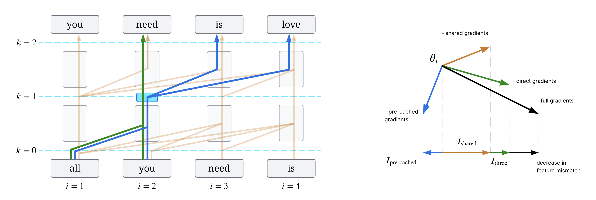

# Understanding the Emergence of Seemingly Useless Features in Next-Token Predictors

[Project page](https://markfryazino.github.io/useless-features-iclr/) | [Read the paper](https://openreview.net/pdf?id=eBAMg7w96m)

<p align="center">
  
</p>

## Abstract

Trained Transformers have been shown to compute abstract features that appear redundant for predicting the immediate next token. We identify which components of the gradient signal from the next-token prediction objective give rise to this phenomenon, and we propose a method to estimate the influence of those components on the emergence of specific features. After validating our approach on toy tasks, we use it to interpret the origins of the world model in OthelloGPT and syntactic features in a small language model. Finally, we apply our framework to a pretrained LLM, showing that features with extremely high or low influence on future tokens tend to be related to formal reasoning domains such as code. Overall, our work takes a step toward understanding hidden features of Transformers through the lens of their development during training.

## Reproducing the experiments

This repository contains the code used for the experiments presented in the paper.

`train.py` and the `src/` folder provide the core classes and methods to run the experiments in Section 4 (Experiments with Small Transformers). We use Weights & Biases Sweeps to run these experiments. The configuration files are in the `conf/` and `sweeps/` folders.

Additionally, `sae_analyze.py` and the `sae_ipynb/` folder contain the remaining code to reproduce Section 5 (Investigating Features in LLMs).

## Setup
Install [uv](https://docs.astral.sh/uv/getting-started/installation/) and create the environment:
```bash
uv init
uv add datasets editdistance hydra-core matplotlib numpy omegaconf openai pandas packaging requests sae-lens scikit-learn scipy seaborn spacy torch tqdm transformer-lens transformers wandb
```

## Reproducing experiments (Section 4)
To reproduce the experiments, run the following for each sweep config in `sweeps/`:
```bash
uv run wandb sweep sweeps/<sweep_name>.yaml  # returns a sweep ID
uv run wandb agent <sweep_id>
```

For example, to run the TinyStories experiments:
```bash
uv run python prepare_tinystories.py data/tinystories  # download and preprocess the dataset
uv run wandb sweep sweeps/tinystories.yaml
uv run wandb agent <sweep_id>
```

## Reproducing SAE analysis (Section 5)
```bash
uv run python sae_analyze.py
uv run python sae_steer.py
```
The notebooks in `sae_ipynb/` contain additional visualizations.

## Citation information

If you find our work useful for your research, please cite it as
```
@inproceedings{rofin2026understanding,
  title={Understanding the Emergence of Seemingly Useless Features in Next-Token Predictors},
  author={Rofin, Mark and Naghiyev, Jalal and Hahn, Michael},
  booktitle={The Fourteenth International Conference on Learning Representations},
  year={2026}
}
```